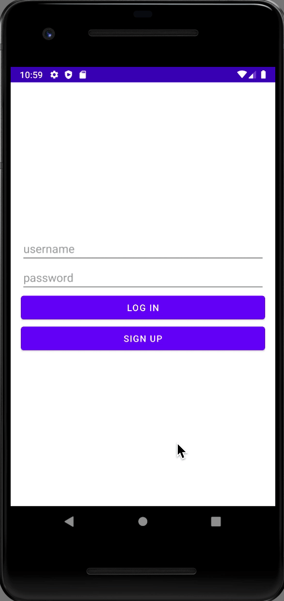

# Tuned

## Table of Contents
1. [Overview](#Overview)
1. [Product Spec](#Product-Spec)
1. [Wireframes](#Wireframes)
2. [Schema](#Schema)

## Overview
### Description
Social music app to explore different genres of music and rate, review, and interact with other users.

### App Evaluation
- **Category:** Social Networking / Music
- **Mobile:** This app would be developed for mobile.
- **Story:** Social network for music lovers. Users are able to rate & reviews albums and tracks of different artists, create lists of different albums / songs, view different reviews / ratings, follow other users to view their latest reviews & lists.
- **Market:** Anyone is able to use this app, it is especially tailored to music fanatics.
- **Habit:** Could be used as often as user want to use the app for, or whenever they want to track the latest music they have listened to and review it.
- **Scope:** User starts out by rating / reviewing any latest albums or songs they have heard and from there they can read reviews from other users and follow them.

## Product Spec

### 1. User Stories (Required and Optional)

**Required Must-have Stories**

- [x] User can sign up or login
- [x] User can create a review
- [x] User can see reviews
- [x] User can rate an album, artist, or track
- [x] Profile page for each user
- [x] User can search up for artists, albums, tracks
- [x] User can view new releases, popular albums, top tracks from discover page

**Optional Nice-to-have Stories**

- [ ] Ability for user to listen to a 30-second preview of a song from the app
- [ ] Artist page including artist different albums / songs
- [ ] Diary to keep track on what songs user listened to on a specific date
- [ ] User can make lists (add tracks / albums to a list for others to view)
- [ ] User can see lists
- [ ] User can comment / like a review or list of another user
- [ ] User can follow other users

### 2. Screen Archetypes

* Login
* Register - User signs up up or logs into their account
* Home Feed Screen - Discover, Reviews, List
  * Discover - User is able to discover new music, page will show new releases, popular tracks / albums, top tracks.
  * Reviews - User is able to see friend's latest reviews and popular reviews on the app.
  * List - User is able to see friend's list and popular lists on the app.
* Search - Search for artists, albums, and tracks
* Alerts - See latest notifcations (i.e xyz user liked your post, xyz commented on your post)
* Profile - See user's profile page
* Create Review Post - User create's their own review for a specific album

### 3. Navigation

**Tab Navigation** (Tab to Screen)

* Discover Feed
* Review Feed
* List Feed
* Album Page
* Artist Page
* User Page

**Flow Navigation** (Screen to Screen)

* Feed
* Profile
* Search
* Create
* Alerts

## UPDATES

### 04/19/21

### 04/11/21

### 04/04/21

### 03/28/21

## Wireframes

### [BONUS] Digital Wireframes & Mockups

### [BONUS] Interactive Prototype

## Schema 

### Models

#### User

   | Property        | Type     | Description  |
   | --------------- | -------- | ------------ |
   | userName        | String   | unique username that displays user page |
   | displayName     | String   | display username that appears on user's page |
   | profilePicture  | String   | profile picture that displays on user's page |
   
#### Review

   | Property            | Type                | Description   |
   | ------------------- | ------------------- | ------------- |
   | reviewID            | String              | unique id for the review post (default field) |
   | author              | Pointer to User     | review author |
   | reviewTitle         | String              | title of review |
   | reviewCaption       | String              | review caption by author |
   | reviewRating        | Number              | rating for album / track  / artist|
   | reviewComment       | String              | comment made under review |
   | reviewCommentsLikes | Number              | amount of likes on specific comment under review |
   | reviewCommentsCount | Number              | number of comments made under review |
   | reviewLikesCount    | Number              | number of likes for the review |
   | createdAt           | DateTime            | date when review is created (default field) |
   | updatedAt           | DateTime            | date when review is last updated (default field) |
   
#### Album

   | Property             | Type                | Description   |
   | -------------------- | ------------------- | ------------- |
   | albumID             | String               | unique id for specific album |
   | albumAverageRating   | Number              | average album rating |
   
#### Track

   | Property         | Type                 | Description   |
   | ---------------- | -------------------- | ------------- |
   | trackID          | String               | unique id for specific track |
   | trackRating      | Number               | average rating for specific track |
   
#### Artist

   | Property            | Type                | Description   |
   | ------------------- | ------------------- | ------------- |
   | artistID            | String              | unique id for specific artist |
   | artistRating        | Number              | average artist rating |
   
#### Lists

   | Property            | Type                | Description   |
   | ------------------- | ------------------- | ------------- |
   | objectId            | String              | unique id for the user post (default field) |
   | author              | Pointer to User     | lists author |
   | listsTitle          | String              | title of list |
   | listsPhoto          | File                | thumbnail photo of list |
   | listsTracks         | String              | tracks in the list |
   | listTracksPhoto     | File                | displays album / ep art of track in lists |
   | listComment         | String              | comment made under lists |
   | listCommentsLikes   | Number              | amount of likes on specific comment under lists |
   | listsCommentsCount  | Number              | number of comments made under lists |
   | listsLikesCount     | Number              | number of likes under lists |
   | createdAt           | DateTime            | date when list is created (default field) |
   | updatedAt           | DateTime            | date when list is last updated (default field) |

### Networking

#### List of network requests by screen
 - Discover Screen
      - (Read/GET) Query new releases
      - (Read/GET) Query popular albums of the week
      - (Read/GET) Query current top tracks
 - Create Review Post Screen
      - (Create/POST) Create a new review post object
 - Profile Screen
      - (Read/GET) Query logged in user object
      - (Update/PUT) Update user profile image
 - Login Screen
      - (Read/GET) Query logged in user object
 - Sign Up Screen
      - (Read/GET) Query logged in user object
      - (Create/POST) Create a new user account
 - Search Screen
      - (READ/GET) Query search results (artist, album, tracks)
 - Artist Screen
      - (Read/GET) Query artist name
      - (Read/GET) Query artist photo
      - (Read/GET) Query artist biography
      - (Read/GET) Query artist top tracks
      - (Read/GET) Query artist albums
      - (Read/GET) Query artist singles and EPs
      - (Read/GET) Query artist featured tracks
      - (Read/GET) Query artist rating
 - Album Screen
      - (Read/GET) Query album name
      - (Read/GET) Query album photo
      - (Read/GET) Query album release year
      - (Read/GET) Query album rating
      - (Read/GET) Query album genre(s)
 - List Screen
      - (Read/GET) Query title of list
      - (Read/GET) Query thumbnail photo of lists
      - (Read/GET) Query tracks in the list
      - (Read/GET) Query album / ep art of tracks in the list
      - (Create/POST) Create a new like on a list
      - (Delete) Delete existing like
      - (Create/POST) Create a new comment on a list
      - (Delete) Delete existing comment
      - (Create/POST) Create a new like on a comment
      - (Delete) Delete existing like on a comment
      - (Read/GET) Query amount of likes
      - (Read/GET) Query amount of comments
      - (Read/GET) Query amount of likes on a comment
 - Create List Screen
      - (Create/POST) Create a new list object
      - (Create/POST) Create list title
      - (Create/POST) Create thumbnail photo of list
      - (Create/POST) Create / Add tracks to list
 - User’s Page Screen
      - (Read/GET) Query user’s username
      - (Read/GET) Query user’s display name
      - (Read/GET) Query user’s profile picture
      - (Read/GET) Query user’s favorite albums / tracks
      - (Read/GET) Query user’s reviews
      - (Read/GET) Query user’s lists
 - Review screen
      - (Read/GET) Query title of review
      - (Read/GET) Query review caption
      - (Read/GET) Query review’s album / track art
      - (Read/GET) Query review’s rating
      - (Create/POST) Create a new like on a review
      - (Delete) Delete existing like
      - (Create/POST) Create a new comment on a post
      - (Delete) Delete existing comment
      - (Create/POST) Create a new like on a comment
      - (Delete) Delete existing like on a comment
      - (Read/GET) Query amount of likes
      - (Read/GET) Query amount of comments
      - (Read/GET) Query amount of likes on a comment
  - Create Review Screen
      - (Create/POST) Create a new review object
      - (Create/POST) Create review title
      - (Create/POST) Create review caption
      - (Create/POST) Create review rating
      - (Read/GET) Query review author (user)
      - (Read/GET) Query album / artist / track info
  - Alerts’s Page Screen
      - (Read/GET) Query user’s username
      - (Read/GET) Query user’s profile picture
      - (Read/GET) Query notification type

### OPTIONAL: Existing API Endpoints

##### Spotify API
- Base URL - [https://api.spotify.com/v1]

   HTTP Verb | Endpoint | Description
   ----------|----------|------------
    `GET`    | /albums/{id} | gets specific album by :id
    `GET`    | /artists/{id} | gets specific artist by :id
    `GET`    | /track/{id} | gets specific track by :id
    `GET`    | /search | get spotify catalog information about albums, artists, tracks
    `GET`    | /browse | get all categories

