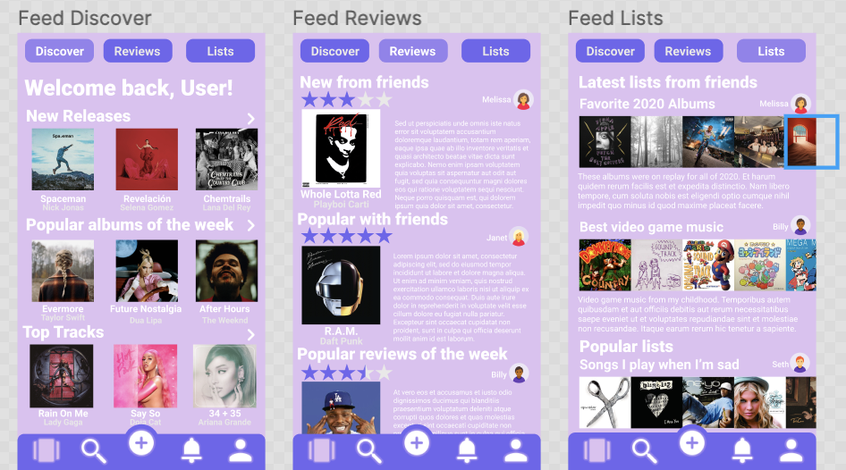
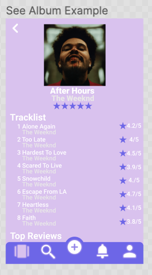
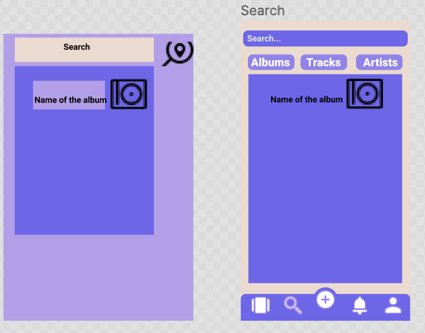
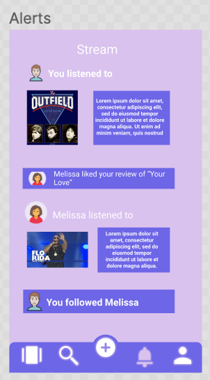
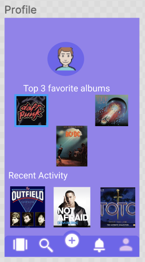
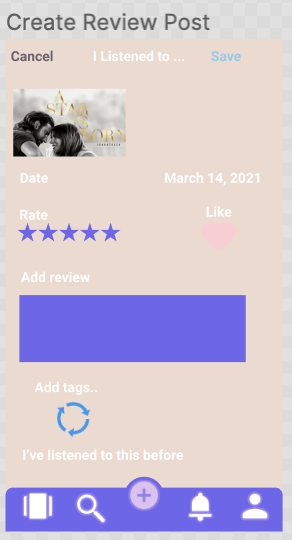
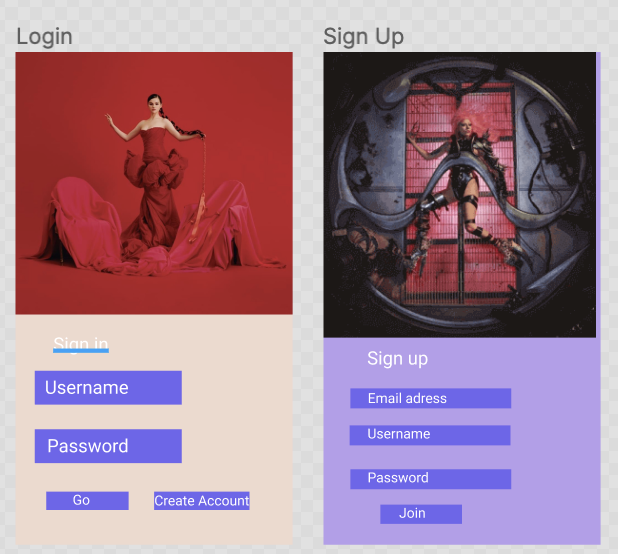

# Tuned

## Table of Contents
1. [Overview](#Overview)
1. [Product Spec](#Product-Spec)
1. [Wireframes](#Wireframes)
2. [Schema](#Schema)

## Overview
### Description
Social music app to explore different genres of music and rate, review, and interact with other users.

### App Evaluation
- **Category:** Social Networking / Music
- **Mobile:** This app would be developed for mobile.
- **Story:** Social network for music lovers. Users are able to rate & reviews albums and tracks of different artists, create lists of different albums / songs, view different reviews / ratings, follow other users to view their latest reviews & lists.
- **Market:** Anyone is able to use this app, it is especially tailored to music fanatics.
- **Habit:** Could be used as often as user want to use the app for, or whenever they want to track the latest music they have listened to and review it.
- **Scope:** User starts out by rating / reviewing any latest albums or songs they have heard and from there they can read reviews from other users and follow them.

## Product Spec

### 1. User Stories (Required and Optional)

**Required Must-have Stories**

* User logs in and rates each songs as they listen to it, to build up a diary of their music history.
* User adds a review and tags to each entry, then shares and discusses it with others.
* Follow your friends to see what they're listening to and linking in your activity feed.
* Make lists, find artist info, and see what songs are popular.
* Track the songs you've listened to, and those you want to listen to.
* Settings (Accesibility, Notification, General, etc.)
* Profile page for each user
* User can add songs / albums to a lsit (playlist) for other users to view

**Optional Nice-to-have Stories**

* Ability for user to listen to a 30-second preview of a song from the app
* Artist page including artist different albums / songs
* Diary to keep track on what songs user listened to on a specific date

### 2. Screen Archetypes

* Login
* Register - User signs up up or logs into their account
* Home Feed Screen - Discover, Reviews, List
  * Discover - User is able to discover new music, page will show new releases, popular tracks / albums, top tracks.
  * Reviews - User is able to see friend's latest reviews and popular reviews on the app.
  * List - User is able to see friend's list and popular lists on the app.
* Search - Search for artists, albums, and tracks
* Alerts - See latest notifcations (i.e xyz user liked your post, xyz commented on your post)
* Profile - See user's profile page
* Create Review Post - User create's their own review for a specific album

### 3. Navigation

**Tab Navigation** (Tab to Screen)

* Discover Feed
* Review Feed
* List Feed
* Album Page
* Artist Page
* User Page

**Flow Navigation** (Screen to Screen)

* Feed
* Profile
* Search
* Create
* Alerts

## Wireframes

### [BONUS] Digital Wireframes & Mockups

### [BONUS] Interactive Prototype

## Schema 
[This section will be completed in Unit 9]
### Models
[Add table of models]
### Networking
- [Add list of network requests by screen ]
- [Create basic snippets for each Parse network request]
- [OPTIONAL: List endpoints if using existing API such as Yelp]
